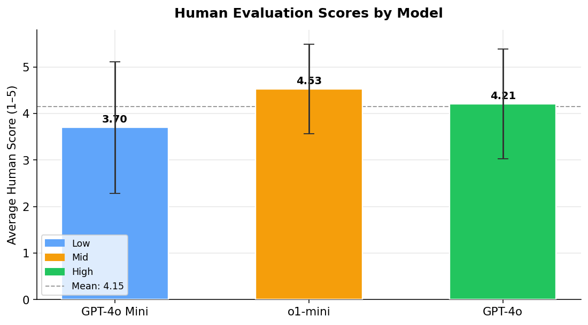
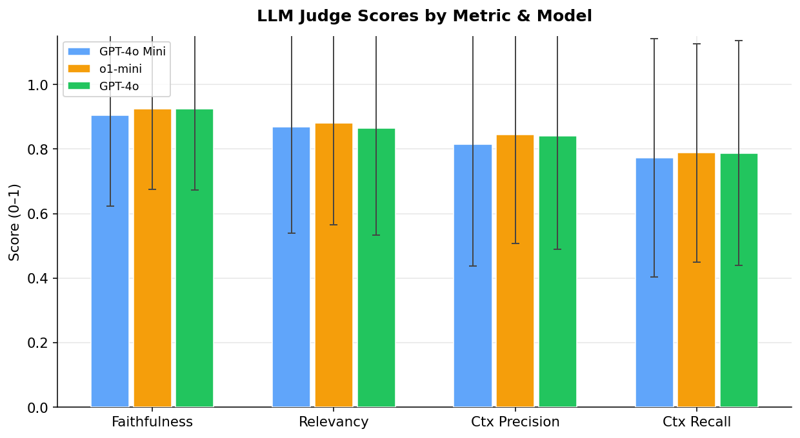
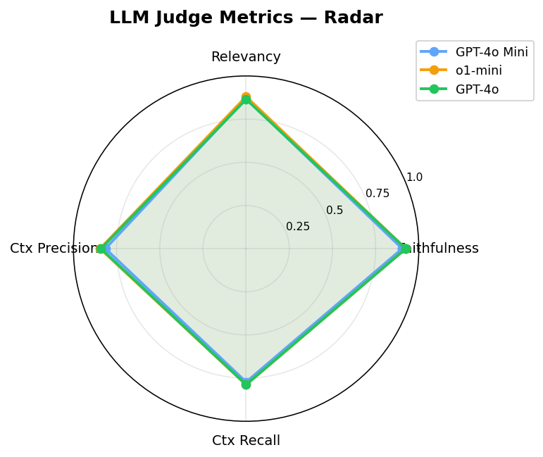
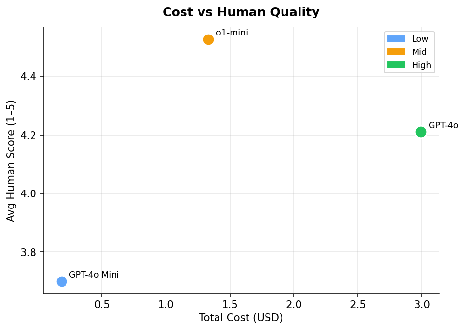
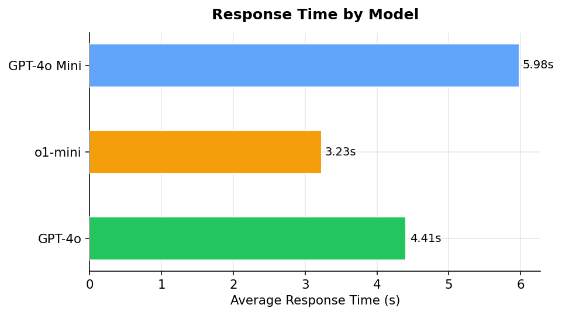
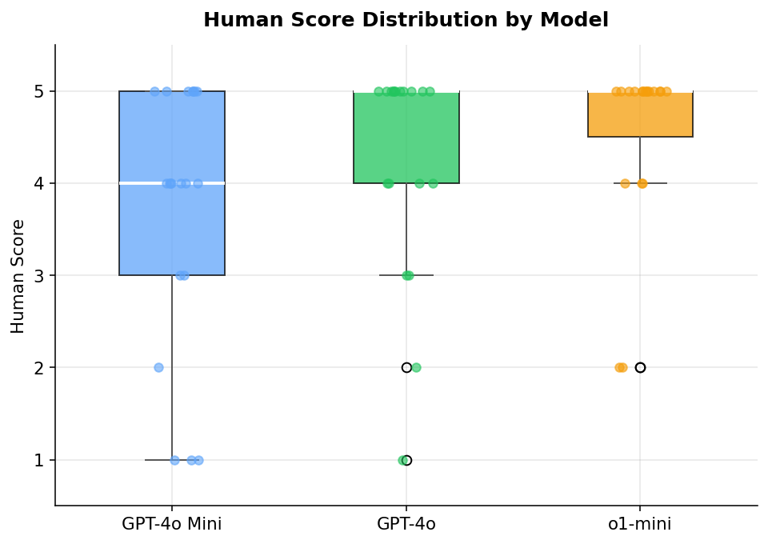

# Intro

This documents our evaluation of our project.

$\langle$ Note: The next two sections are the roughly the same as your milestone 2, plus any improvements. $\rangle$

# Data card information

$\langle$ replace this with detailed information about the dataset $\rangle$

$\langle$ Note: if you have a small dataset, submit it along with the qmd file and the html file. If it's large, the URL will probably suffice unless it's somehow walled off. $\rangle$

Make sure you include at least

- URL
- source (original source not repository)
- repository (e.g., HuggingFace, Kaggle, etc.)
- task you intend to use it for (e.g., question answering, summarization, etc.)
- size
- structure (e.g., train, test split)
- other information, depending on the dataset's documentation

# Data dictionary

$\langle$ replace this with a data dictionary, a table listing info about each column $\rangle$

Here's an example of a table:

-------------------------------------------------------------
 Centered   Default           Right Left
  Header    Aligned         Aligned Aligned
----------- ------- --------------- -------------------------
   First    row                12.0 Example of a row that
                                    spans multiple lines.

  Second    row                 5.0 Here's another one. Note
                                    the blank line between
                                    rows.
-------------------------------------------------------------

Table: Here's the table caption. It, too, may span
multiple lines.

*Warning: if you use the Visual editor in RStudio, it will mangle the above table.*

The data dictionary should be laid out like a table. It should include

- column name
- description
- type
- units
- example

# Steps to create the chatbot

This can be what you turned in for milestone 3.

Note that you will have to render the file so you will probably have to comment out the line that lauches the interface or the rendering process will hang.

# Evaluation

## Overview

This evaluation compares three OpenAI models — **GPT-4o Mini** (low tier), **GPT-4o** (mid tier), and **o1-mini** (high tier) — integrated into a Retrieval-Augmented Generation (RAG) pipeline built on a FAISS vector store over course PDF documents (syllabus and textbook). The evaluation combines two complementary approaches:

- **LLM-as-Judge**: GPT-4o was used as an automated judge to score all 98 samples per model across four RAG-specific metrics: Faithfulness, Answer Relevancy, Context Precision, and Context Recall.
- **Human Evaluation**: 19–20 randomly flagged samples per model were scored by a human evaluator on a 1–5 star scale, assessing overall response quality relative to the ground truth.

The goal was to determine the optimal balance of cost, speed, and answer quality for a course-assistant RAG application.

---

## Details

Evaluation was conducted on a dataset of 98 question–answer pairs derived from a graduate NLP course syllabus and textbook. Ground truth answers were manually written by the course instructor. Each model was queried through the same RAG pipeline (identical retrieval, chunking, and prompt), with only the chat completion model swapped between runs.

**LLM Judge metrics** (scored 0.0–1.0, higher is better):

- **Faithfulness**: Are all claims in the answer grounded in the retrieved context?
- **Answer Relevancy**: Does the answer directly address the question?
- **Context Precision**: Do retrieved chunks contain the information needed to answer?
- **Context Recall**: Does the answer cover all key information present in the context?

**Human scores** (1–5 stars): Evaluators compared model answers against ground truth, rating accuracy, completeness, and clarity.

---

## Quantitative Evaluation

### Task: Answer questions grounded in course PDF documents (syllabus + textbook)

#### Model Performance Summary

| Model | Tier | Total Cost | Avg Response Time | Avg Output Tokens | Human Score (★/5) |
|-------|------|-----------|-------------------|-------------------|-------------------|
| GPT-4o Mini | Low | $0.18 | 5.98s | 44 | 3.70 ± 1.42 |
| GPT-4o | Mid | $2.99 | 4.41s | 42 | 4.21 ± 1.18 |
| o1-mini | High | $1.33 | 3.23s | 43 | 4.53 ± 0.96 |

#### LLM Judge Scores (all 98 samples, scored 0–1)

| Model | Tier | Faithfulness | Relevancy | Ctx Precision | Ctx Recall |
|-------|------|-------------|-----------|---------------|------------|
| GPT-4o Mini | Low | 0.904 | 0.870 | 0.815 | 0.773 |
| GPT-4o | Mid | 0.924 | 0.865 | 0.841 | 0.787 |
| o1-mini | High | 0.924 | 0.880 | 0.846 | 0.789 |

#### Human Evaluation (20 flagged samples per model)

| Model | Tier | Samples Scored | Avg ★ | Std Dev |
|-------|------|---------------|-------|---------|
| GPT-4o Mini | Low | 20 | 3.70 | ±1.42 |
| GPT-4o | Mid | 19 | 4.21 | ±1.18 |
| o1-mini | High | 19 | 4.53 | ±0.96 |

---

### Key Findings

- **Best Human-Rated Quality**: o1-mini scored highest at 4.53/5 with the lowest variance (±0.96), suggesting more consistent responses — despite being a reasoning-focused model not originally designed for RAG.
- **Best Value**: GPT-4o offers a strong middle ground — 14% better human score than GPT-4o Mini at 16× the cost, but 10% cheaper than o1-mini with only slightly lower quality (4.21 vs 4.53).
- **Fastest**: o1-mini was the fastest at 3.23s average, outperforming GPT-4o Mini (5.98s) despite its reasoning overhead — likely because it generates fewer intermediate tokens in this constrained RAG context.
- **Cheapest**: GPT-4o Mini at $0.18 total is 7× cheaper than GPT-4o and 7× cheaper than o1-mini, making it viable for high-volume deployment where cost is the primary constraint.
- **LLM Judge Scores Are Tight**: Automated metrics differ by less than 2% across models, suggesting retrieval quality (not the LLM itself) is the primary bottleneck — all three models ground their answers similarly in the retrieved context.
- **Human Scores Show Wider Gaps**: Human evaluation reveals larger quality differences (3.70 vs 4.53) that automated metrics miss, highlighting the value of human eval for RAG systems.

### Performance Metrics Explained

- **Human Score**: Human evaluation on 1–5 scale assessing accuracy, completeness, and clarity relative to ground truth.
- **Faithfulness**: Fraction of answer claims supported by retrieved context (LLM judge, 0–1).
- **Context Precision / Recall**: Quality of the retrieval step — precision measures chunk relevance, recall measures coverage.
- **Response Time**: End-to-end latency from query to answer, including embedding, FAISS retrieval, and LLM generation.
- **Total Cost**: Accumulated OpenAI API cost across all 98 queries (input + output tokens).

---

### Visualizations

#### Human Evaluation Scores by Model

*Average human score (1–5) per model with standard deviation error bars. Higher is better.*

---

#### LLM Judge Scores by Metric and Model

*Grouped bar chart showing all four automated judge metrics side by side. Scores are averaged over all 98 samples.*

---

#### LLM Judge Metrics — Radar View

*Spider/radar chart showing the metric profile for each model. A larger area indicates stronger overall performance.*

---

#### Cost vs Human Quality

*Scatter plot of total API cost against average human score. Points toward the top-left represent better value.*

---

#### Average Response Time by Model

*Horizontal bar chart of average end-to-end response time. Lower is better.*

---

#### Human Score Distribution by Model

*Box plot with jittered data points showing the full distribution of human scores. Tighter boxes indicate more consistent quality.*

---

## Qualitative Findings

*[To be completed with human judgment observations about answer quality, failure modes, and alignment with course assistant requirements.]*

# Conclusion
Here you discuss your lessons learned at a higher level.

